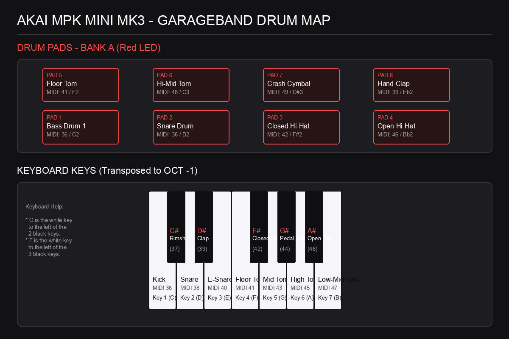
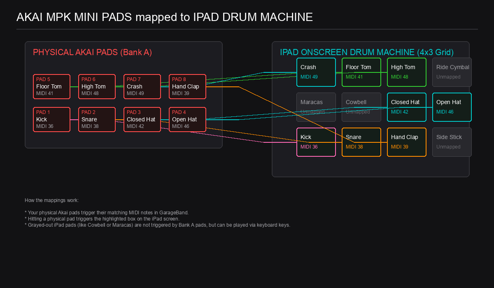

# Akai MPK Mini MK3 - GarageBand Drum Preset Mapping

A custom, ready-to-import program preset (`.mpkmini3`) for the Akai MPK Mini MK3 that maps the 8 pads ergonomically to work seamlessly with GarageBand's default drum kits.

---

## 💾 Download Preset File

👉 **[Download GarageBandDrums.mpkmini3 (Direct Link)](https://raw.githubusercontent.com/bilalshirazi/akai-mpk-mini-garageband-drums/main/GarageBandDrums.mpkmini3)** (Right-click and select *Save Link As...* or *Download Linked File*)

---

## 🎨 Visual Drum Maps (Pads & Keys)

### 1. General Keyboard & Pad Layout Diagram
Use this labeled diagram to identify which drum sounds are mapped to the physical pads (Bank A) and the keyboard keys (set to `OCT -1`):

### 2. iPad Touchscreen Drum Machine Diagram (Classic Drum Machine)
If you are playing an electronic kit in GarageBand for iPad (which displays a 4x3 grid of 12 pads on the screen), use this diagram to see how your physical Akai pads link to the on-screen buttons:

---

## 🛠️ The Problem

By default, the factory presets on the Akai MPK Mini MK3 split the drum kit across two pad banks (Bank A and Bank B):
- **Bank B** contained the lower drum elements (Kick, Snare, Closed Hi-Hat).
- **Bank A** (which is active by default when the controller powers on) only contained auxiliary elements (Toms, Crash, open hat, etc.).

This made playing standard beats impossible without constantly toggling between Bank A and Bank B.

---

## 🚀 The Solution

This repository provides **`GarageBandDrums.mpkmini3`**, which keeps the factory default knob CCs and arpeggiator controls intact, but restructures the pad note mappings:
- **Bank A** has been customized into an **Ergonomic Finger Drumming Layout**. You can now play a full kit (Kick, Snare, Closed Hat, Open Hat, Toms, Crash, and Clap) on a single bank.
- **Bank B** remains mapped to the factory-default **Chromatic General MIDI Layout** (consecutive MIDI notes 35–43, skipping hand clap).

---

## 🥁 Pad Layouts

Use the physical **Bank A/B** button on your MPK Mini MK3 to toggle layouts:

### Bank A (Red LED): Ergonomic Finger Drumming Layout (Customized)
*Optimized for comfort, placing the core groove components (Kick, Snare, Hi-Hats) under your primary fingers on the bottom row.*

| Pad | Row | MIDI Note | Note Name | Drum Sound |
| :--- | :--- | :--- | :--- | :--- |
| **Pad 1** | Bottom Left | 36 | C2 | Bass Drum 1 (Kick) |
| **Pad 2** | Bottom Mid-Left | 38 | D2 | Snare Drum |
| **Pad 3** | Bottom Mid-Right | 42 | F#2 | Closed Hi-Hat |
| **Pad 4** | Bottom Right | 46 | Bb2 | Open Hi-Hat |
| **Pad 5** | Top Left | 41 | F2 | Low Floor Tom |
| **Pad 6** | Top Mid-Left | 48 | C3 | Hi-Mid Tom |
| **Pad 7** | Top Mid-Right | 49 | C#3 | Crash Cymbal 1 |
| **Pad 8** | Top Right | 39 | Eb2 | Hand Clap |

### Bank B (Green LED): Chromatic General MIDI Layout (Factory Default)
*The default layout shipped with the Akai editor. It maps the first 8 consecutive MIDI drum notes (C2 to G2, skipping the clap).*

| Pad | Row | MIDI Note | Note Name | Drum Sound |
| :--- | :--- | :--- | :--- | :--- |
| **Pad 1** | Bottom Left | 35 | B1 | Bass Drum 2 |
| **Pad 2** | Bottom Mid-Left | 36 | C2 | Bass Drum 1 (Kick) |
| **Pad 3** | Bottom Mid-Right | 37 | C#2 | Side Stick (Rimshot) |
| **Pad 4** | Bottom Right | 38 | D2 | Snare Drum |
| **Pad 5** | Top Left | 40 | E2 | Electric Snare |
| **Pad 6** | Top Mid-Left | 41 | F2 | Low Floor Tom |
| **Pad 7** | Top Mid-Right | 42 | F#2 | Closed Hi-Hat |
| **Pad 8** | Top Right | 43 | G2 | Mid Floor Tom |

---

## 🎹 Using the Keyboard Keys for Drums

To play drum parts using the actual keys on your keyboard, you must transpose the keyboard down so the keys fall into the drum range (MIDI Octave 2).
- **Setup**: Press the **`Octave Down`** button on your controller **once** (so that it lights or indicates **`OCT -1`**).

### How to Find the Keys on Your Keyboard
If you aren't familiar with musical note names (C, D, E, F, G, A, B), here is a simple way to find them on your MPK Mini's physical keys (starting from the far left):

*   **Key 1 (C)**: The far-left white key (located immediately to the left of the group of **2 black keys**).
*   **Key 2 (D)**: The white key directly between the group of **2 black keys**.
*   **Key 3 (E)**: The white key immediately to the right of the group of **2 black keys**.
*   **Key 4 (F)**: The white key immediately to the left of the group of **3 black keys**.
*   **Key 5 (G)**: The white key between the 1st and 2nd black keys in the group of **3 black keys**.
*   **Key 6 (A)**: The white key between the 2nd and 3rd black keys in the group of **3 black keys**.
*   **Key 7 (B)**: The white key immediately to the right of the group of **3 black keys**.

### Keyboard Key to Drum Map
- **The White Keys** (from left to right) will trigger:
  1. **Key 1 (C)**: Kick (36)
  2. **Key 2 (D)**: Snare (38)
  3. **Key 3 (E)**: Electric Snare (40)
  4. **Key 4 (F)**: Low Floor Tom (41)
  5. **Key 5 (G)**: Mid Floor Tom (43)
  6. **Key 6 (A)**: High Floor Tom (45)
  7. **Key 7 (B)**: Low-Mid Tom (47)
- **The Black Keys** (from left to right) will trigger:
  - **Key C# (between 1 & 2)**: Side Stick / Rimshot (37)
  - **Key D# (between 2 & 3)**: Hand Clap (39)
  - **Key F# (between 4 & 5)**: Closed Hi-Hat (42)
  - **Key G# (between 5 & 6)**: Pedal Hi-Hat (44)
  - **Key A# (between 6 & 7)**: Open Hi-Hat (46)

---

## 🎶 Classic Beats Practice Guide

Here is how to play 4 classic beats on your pads or keys.

### 1. The Classic Rock Backbeat (4/4)
*The most fundamental drum beat in modern music.*
- **Tempo**: 100 - 120 BPM
- **Instruments**: Kick, Snare, Closed Hi-Hat

| Count | 1 | & | 2 | & | 3 | & | 4 | & |
| :--- | :---: | :---: | :---: | :---: | :---: | :---: | :---: | :---: |
| **Hi-Hat (Pad 3 / Key F#)** | X | X | X | X | X | X | X | X |
| **Snare (Pad 2 / Key 2)** | | | X | | | | X | |
| **Kick (Pad 1 / Key 1)** | X | | | | X | | | |

*   **How to play**: Keep a steady "tick-tick-tick" with your right hand on the Hi-Hat. Tap the Kick with your left thumb on beats 1 and 3, and hit the Snare with your left index finger on beats 2 and 4.

---

### 2. Boom-Bap Hip-Hop Groove
*The signature golden-era hip-hop rhythm.*
- **Tempo**: 85 - 95 BPM
- **Instruments**: Kick, Snare, Closed Hi-Hat, Open Hi-Hat

| Count | 1 | & | 2 | & | 3 | & | 4 | & |
| :--- | :---: | :---: | :---: | :---: | :---: | :---: | :---: | :---: |
| **Hi-Hats** | Closed | Closed | Closed | Closed | Closed | Closed | Closed | Open |
| **Snare (Pad 2 / Key 2)** | | | X | | | | X | |
| **Kick (Pad 1 / Key 1)** | X | X | | | | X | | |

*   **How to play**: Notice the double Kick hit at the beginning ("boom-boom-bap"). The Open Hi-Hat on the "&" of 4 creates a nice breathing effect leading back to the start.

---

### 3. Reggae "One Drop" Beat
*The heartbeat of reggae music. The defining feature is that beat 1 is completely empty (no kick), and the kick/snare strike together only on beat 3.*
- **Tempo**: 75 - 80 BPM
- **Instruments**: Kick, Rimshot (Key C# or Bank B Pad 3), Closed Hi-Hat

| Count | 1 | & | 2 | & | 3 | & | 4 | & |
| :--- | :---: | :---: | :---: | :---: | :---: | :---: | :---: | :---: |
| **Hi-Hat (Pad 3 / Key F#)** | | X | | X | | X | | X |
| **Rimshot (Key C#)** | | | | | X | | | |
| **Kick (Pad 1 / Key 1)** | | | | | X | | | |

*   **How to play**: Play the Hi-Hat strictly on the offbeats (the "&" counts). Let beat 1 go by in silence, and land a heavy, unified strike on the Kick and Rimshot together on beat 3.

---

### 4. Drum & Bass / Jungle Beat
*A fast, syncopated rhythm. This uses "ghost notes" (very quiet snare hits) to fill the gaps.*
- **Tempo**: 160 - 175 BPM
- **Instruments**: Kick, Snare, Closed Hi-Hat, Open Hi-Hat

| Count | 1 | & | 2 | & | 3 | & | 4 | & |
| :--- | :---: | :---: | :---: | :---: | :---: | :---: | :---: | :---: |
| **Hi-Hats** | Closed | | Closed | | Closed | | Closed | Open |
| **Snare (Pad 2 / Key 2)** | | | X | | | | X | (Ghost) |
| **Kick (Pad 1 / Key 1)** | X | | | X | | X | | |

*   **How to play**: Start slow! Once you get the syncopated kicks on the "&" of 2 and 3 down, speed it up to get that rolling jungle feel.

---

## 💡 Troubleshooting & Performance Tips

*   **Bass Drum Triggering with Crash**: By default in GarageBand acoustic kits (like *SoCal*), hitting the Crash Cymbal (Pad 7 / note 49) will automatically trigger a Kick Drum (Bass Drum) sound at the same time to make the crash hit sound fuller. If you want the Crash Cymbal to play completely on its own, open **Track Settings > Recording** in GarageBand and toggle **"Bass Drum with Cymbal"** off.
*   **No Sound on Pads**: Double-check that you have loaded the program preset and selected it on your device. Press and hold the **`Favorites`** button and strike **`Pad 1`** to activate the preset program slot. Also, verify that the **`Bank A/B`** button is glowing **Red** (Bank A).

---

## 📥 How to Import the Program Preset

1. **Close GarageBand** (to release the USB MIDI port).
2. Open the **MPK Mini 3 Program Editor** on your Mac.
3. Select **File > Open Program...** and open `GarageBandDrums.mpkmini3`.
4. Select a program slot (e.g., **Program 1**) in the editor.
5. Click **File > Send Program...** (or click the **S** icon next to the program slot number) to upload the program to your controller.
6. Open GarageBand, load a drum kit software instrument track, and test the pads!
7. **Important:** Make sure to select **Program 1** on your device (press and hold the **Favorites** button, then press **Pad 1**).

---

## 📂 Files in this Repository

*   **`GarageBandDrums.mpkmini3`**: The customized preset file ready for import.
*   **`Garageband.mpkmini3`**: The original, unaltered factory default preset (kept for backup).
*   **`Untitled.mpkmini3`**: The original raw device program export.
*   **`mpk_mini_drum_map.png`**: Visual drum mapping schematic diagram for pads and keys.
*   **`mpk_mini_ipad_grid_map.png`**: Visual drum mapping diagram specifically for the iPad's 12-pad grid.

---

## 📚 References & Learning Resources

To learn more about MIDI mapping and GarageBand's drum kit architecture:
- **YouTube Video Tutorial**: [How to Program Akai MPK for GarageBand Drums on iOS](https://www.youtube.com/watch?v=FZTibkal8d4) by Dark Roast Recording (detailed setup workflow).
- **Jamstik Setup Guide**: [How To Make Beats in GarageBand](https://jamstik.com/blogs/jamstik/garageband-drum-mapping-and-jamstik-midi-mapping) (explains octave transposition logic for external controllers).
- **Wikipedia Reference**: [General MIDI Specification](https://en.wikipedia.org/wiki/General_MIDI#Percussion) (the international standard percussion key map).
- **Apple Support Guide**: [Play the Drums in GarageBand for iPad](https://support.apple.com/en-euro/guide/garageband-ipad/chs392830c2/ipados) (details onboard drum kit behaviors, touch sensitivity, and the "Bass Drum with Cymbal" setting).

